# CDW hardening campaign: final report

Branch `research/contextual-dynamic-weakness-hardening` (from `e73dd355`). Preregistration `05b507e3`. No push. TX4 untouched. Every number below is read from `results/hardening/*.json` by `experiments/cdw_hardening/CDWH_REPORT.py`. Analyses added after the preregistered results (internal-review requests) are marked *post hoc*.

## 1. Verdict

The contextual core of CDW survives a new preregistered holdout, at small magnitude. In 17/19 base-stable new-holdout policies the same replacement moves the same tracked electromechanical mode in opposite directions in two nested stable portfolios (level D; primary level-C gate 0.895 >= 0.75 passes on the point estimate, bootstrap interval 0.74-1.00). The effects are about 0.01 s^-1 (level-D quartiles [0.0111, 0.0127, 0.0152] s^-1, about 0.3% damping ratio) and vanish above 0.05 s^-1; both directions on one tracked mode occur in 3/19 policies.

GOLD-B holds with margin: on the 8 preregistration-eligible conditions the re-equilibrated sensitivity of the planned portfolio ranks finite reinforcements at median Spearman 0.985 against 0.491 for |P_e| (lower 95% bound of the paired advantage 0.477 > 0.20). On the 24 new policies it reaches 0.996 against 0.712 for the frozen derivative and 0.818 for a fixed list learned from other clusters (post hoc), and it also ranks doublings (0.992) and outages (0.885). The secondary test T2 is not significant (p 0.061, six clusters).

Weakened or negative: (i) the fixed-ranking failure (p* 0.75, regret 0.38) comes from replacements that cross a singularity-induced-bifurcation-type instability of the phasor model at high converter share (2089/2265 material regrets leave the EM band; post hoc: alpha jumps to 3773-109804 s^-1 within one 0.025 step where sigma_min(g_z) is 0.002-0.007); with a stability screen a fixed ranking errs in 0.065 of feasible decisions; (ii) the modal-mixing mechanism is not confirmed (new rho 0.55, p 0.016); (iii) the reversals and the specific branch ranking are not reproduced by a frozen WECC library GFL chain; (iv) corridors: TXother (the other eight transformers) meets the preregistered rule: top 5% of size-matched arbitrary groups in 0.83 of the 64 new conditions, but 16/24 new policies against 37/40 draws at P4, so the pass rests on the draws; old holdout 0.78; all 12 transformers 0.69 (fails); spectral cutsets <= 0.03.

## 2. Phase status

| phase | status | key file |
|---|---|---|
| H0 preregistration | committed `05b507e3` | `docs/CDW_HARDENING_PREREG_V1.md` |
| H1 new policy holdout (24 maximin LHS) | COMPLETE, 19 base-stable | `results/hardening/prereg_inputs/hardening_policies.json` |
| H2 chain identity | PROVED (classical algebra; locates interaction terms) | `theory/CDW_CONTEXTUAL_CURVATURE_THEOREM.md` |
| H3 nested reversal | PASS (0.895, point estimate) | `results/hardening/H03_gate.json` |
| H4 fixed ranking + transfer | PASS (FULL); fails in EM stratum | `results/hardening/H04_gate.json` |
| H5 GOLD-A statistics | COMPLETE | `results/hardening/H05_stats.json` |
| H6/H7 GOLD-B new holdout | PASS (literal-eligible set and full set) | `results/hardening/H07_goldb_gate.json` |
| H8 frozen vs total | COMPLETE | `results/hardening/H08_*` |
| H9-H11 corridors | PASS (TXother; carried by the P4 draws, 16/24 policies) | `results/hardening/H10_gate.json, H11_corridor_table.csv` |
| H12/H13 mixing | NEGATIVE (primary fails) | `results/hardening/H13_mixing.json` |
| H14-H16 topology EM | SUPPORTED (supporting observation) | `results/hardening/H15_topology_gate.json` |
| H17 ALT-WECC qualification | PASS Q1-Q4 (with logged refinements) | `results/hardening/alt/H17_qualification_andes.json` |
| H18 cross-model matrix | A MODEL-SPECIFIC (uninformative, pinned pole); uniform tested-policy rule: C MODEL-SPECIFIC, C2 TRANSFERS, D PARTIAL, E TRANSFERS | `results/hardening/H18_gate.json, H31_revision.json` |
| H19 evidence layers | 7/8 positive (L8 negative); SUPPORTED, not STRONGLY | `results/hardening/H19_evidence.json` |
| H20 novelty boundary | COMPLETE | `docs/CDW_NOVELTY_BOUNDARY.md` |
| H21 literature | 58 verified entries | `results/CDW_LITERATURE_GAP_MATRIX.csv` |
| H22 reviewer attack | COMPLETE | `docs/CDW_REVIEWER_ATTACK.md` |
| H23-H30 paper + supplement | COMPLETE (revised after H31) | `reports/papers/cdw_contextual_dynamic_weakness/` |
| H31 internal reviews | two independent internal reviews, both MAJOR REVISION; fixed where existing evidence permits (docs/CDW_AUTHOR_RESPONSE_TO_INTERNAL_REVIEW.md) | `docs/CDW_REVIEWER1_FINAL.md, CDW_REVIEWER2_FINAL.md, CDW_AUTHOR_RESPONSE_TO_INTERNAL_REVIEW.md` |
| determinism | identical in every summary field | `results/hardening/CDWH_DETERMINISM.json` |

## 3. The 22 final questions (H33)

**Q1. Does nested contextual sign reversal survive the new holdout?** Yes. Base-stable new policies with a nested reversal: level A 1.00, B 0.95, C 0.895 (old holdout C 0.889). The level-C gate passes on the point estimate; its bootstrap interval (0.74-1.00) and the exact binomial interval (0.67-0.99) reach below 0.75.

**Q2. Does same-mode electromechanical reversal survive?** Yes at level D in 17/19 (2543 pairs: s->d 743, d->s 1800); both directions in 3/19. Magnitudes: quartiles [0.0111, 0.0127, 0.0152] s^-1, max 0.042. Coverage vs threshold: level D 11/19 at 0.02, 5/19 at 0.03, 0 at 0.05. Gap-robust coverage 16/19; continuation ends on the matched mode in 100% of 60 marginals (post hoc).

**Q3. Is the optimal fixed node ranking still materially insufficient?** Over all transitions yes (p* 0.75, regret 0.38; regret-optimal order 0.344). In the EM stratum no (p* 0.97, regret 0.03). With a stability screen 0.065 on contexts with a stable option (0.22 have none). A portfolio-conditioned gSCR screen errs in 0.76 (post hoc).

**Q4. How large is the old-to-new holdout shift?** Negligible: p* shift -0.002 (interval -0.036 to 0.041); regret shift 0.007; level-C coverage 0.889 old vs 0.895 new.

**Q5. Does GOLD-A remain strong enough for a headline claim?** For the existence of nested same-mode reversals, yes, stated with its magnitude (about 0.01 s^-1) and its model boundary. The fixed-ranking half is a diagnostic about singularity crossings, not an EM result.

**Q6. Does total dynamic line sensitivity still beat every static baseline on the new holdout?** Yes: Dtotal exceeds the per-condition best static index in 1.00 of conditions (oracle static median 0.499). Static indices do not change across conditions; against a learned fixed list the margin is smaller (0.818 new policies, 0.959 draws), and Dtotal still wins in every condition (post hoc).

**Q7. Is the improvement statistically and practically material?** Practically yes: median paired advantage 0.492 (CI 0.477-0.608); top-5 precision 1.00 vs 0.20. Statistically: T2 sign-flip p 0.061 on the literal 8-condition set (6 clusters, not significant), < 1e-3 on all 64.

**Q8. When does re-equilibration materially change the line ranking?** In 0.28 of V4 conditions by the H2 rule; every condition has at least one frozen/total sign flip; the frozen derivative drops to 0.712 on the new policies while Dtotal stays 0.996. For controller coordinates frozen = total (2.2e-07), as the affinity argument predicts; for loads the operating-point term dominates in 61% of cases.

**Q9. Does TXother remain a strong corridor under equal intervention budget?** Family-A null percentile >= 0.95 in 0.83 of new conditions (median percentile 0.99); TXother (the other eight transformers) meets the preregistered rule: top 5% of size-matched arbitrary groups in 0.83 of the 64 new conditions, but 16/24 new policies against 37/40 draws at P4, so the pass rests on the draws; old holdout 0.78; all 12 transformers 0.69 (fails); spectral cutsets <= 0.03.

**Q10. Does it beat size-matched random connected corridors?** Family B: >= 0.95 in 0.84 of new conditions (old holdout 0.81).

**Q11. How much of old modal-mixing variation was controller- vs frequency-induced?** Variance terms of the mixing change: controller 24%, frequency 106%, 2cov -30% (not additive shares).

**Q12. Does fixed-frequency modal mixing still correlate with contextuality?** Not at the preregistered bar: new rho 0.55 (p 0.016, Holm 0.033); old holdout at fixed frequency rho 0.21. Not confirmed (low power at n = 19).

**Q13. After filtering to EM modes, can topology still both remove and create incompatibility?** Yes: removal at P4 by ['dbl13', 'dbl43', 'dbl1', 'dbl0'] (lines 1-2, 1-39, 8-9, transformer 23-36); 45 EM creations of hyperedges of size <= 3, all outages, 34 at discovery, 8 old, 3 new; 0 fast-only. Expected N-1 behavior; a supporting observation.

**Q14. Do Fiedler/gSCR/static topology scores remain poor predictors of the EM effect?** Yes: no score meets |rho| >= 0.6 in >= 75% of policies (best fraction 0.38); their medians of about |0.5| separate outages from doublings, and within doublings they are near zero (Fiedler 0.00).

**Q15. Does contextual reversal transfer to a genuinely dynamic alternative converter model?** No. Preregistered global test: 0.0 of 7 (custom GFL 0.71), uninformative because an isolated REPCA1 pole pins alpha at -0.100 s^-1. Post hoc EM-tracked: stabilizing at 3/7, nested reversal at 1/7. Library voltage control on (QFLAG=1, post hoc): 0/7 global, 0/7 tracked.

**Q16. Does dynamic link ranking transfer?** The specific ranking does not (median Kendall 0.06). The method does, marginally (C2 advantage 0.203 against the 0.20 bar, 3 of 7 policies below).

**Q17. Which findings are model-specific?** The reversals; the specific branch ranking; the singularity crossings behind the fixed-ranking failure (idealized custom GFL, not tested in ALT). Carried over: the ranking method (marginal), corridor top-1 agreement PARTIAL (0.71), topology direction (1.00 on 29 pairs).

**Q18. What exact novelty remains after the literature review?** An empirical, preregistered case study (docs/CDW_NOVELTY_BOUNDARY.md): nested reversals of SG->GFL replacements graded to the same tracked EM mode on a held-out policy design; the anatomy of fixed-ranking failure as singularity crossings, with stability-screened and static-screen baselines; held-out evaluation of the portfolio-conditioned re-equilibrated sensitivity as a reinforcement ranking against frozen, learned-list and static baselines; a frozen library-GFL boundary. No single ingredient is new; displacement effects on modes (Gautam 2009, Quintero 2014), feasible sensitivities (Smed 1993, Nam 2000) and non-submodular spectral set functions (Olshevsky 2018) are prior work.

**Q19. What are the 3 strongest defensible paper contributions?** (1) Portfolio-conditioned re-equilibrated reinforcement ranking (STRONGLY_SUPPORTED on the preregistered gate; beats frozen, learned list and static indices; also doublings and outages). (2) Nested same-mode EM reversal on the holdout (SUPPORTED; small). (3) Why fixed unit rankings fail here: singularity crossings at high share, removable by a stability screen, not by a gSCR screen (SUPPORTED, FULL only; exploratory mechanism).

**Q20. What claims must be dropped or weakened?** Dropped: modal-mixing mechanism; model-independent reversal; converter-independent branch ranking; 'certificate' as a contribution; 'rankings do not transfer'; 'fast converter-control modes'; any computational-cost claim; the Laplacian story (the contextual weakness lives in the controlled operator, not the static network spectrum); 'weak corridor' without the equal-budget, size-null and policy/draw qualifiers. Weakened: 'weakness is contextual' to SUPPORTED; topology to a supporting observation.

**Q21. Is the paper ready for TPWRS?** Not yet for a TPWRS claims paper. The revised manuscript is internally consistent, preregistered and fully traceable, and it is suitable as a preprint or an empirical case-study submission; but both internal reviewers scored novelty (3 and 5 of 10) and model adequacy (3 and 3 of 10) low, and those scores cannot be raised with the existing evidence: one network, one custom GFL, D = 0, no governors, constant-power loads, and reversals of about 0.01 s^-1 that the library converter does not reproduce.

**Q22. If not, what single missing experiment blocks submission?** One preregistered replication on a second network (e.g. IEEE 68-bus NETS-NYPS) with realistic SG damping and governors: sampled nested replacement chains for level-D reversals at material magnitude (H3 rule) and the GOLD-B total-vs-frozen-vs-learned-list ranking test (H7 rule). It decides whether C1 generalizes beyond one idealized benchmark; C3 is already strong.

## 4. Final claim matrix

| claim | final status |
|---|---|
| Chain identity locates an interaction term of the matching sign for every nested reversal | PROVED (classical algebra) |
| Nested EM same-mode contextual sign reversal | SUPPORTED (small effects; one network; not reproduced by the library converter) |
| alpha_perp is neither submodular nor supermodular (both nested directions) | SUPPORTED |
| Oracle fixed node ranking materially insufficient | SUPPORTED (FULL only; driven by singularity-type crossings; nearly adequate with a stability screen) |
| Fixed rankings do not transfer across policies | NOT SUPPORTED as a separate claim (transfer adds 0.026 regret; L6 rule met) |
| Weakness is contextual (8-layer evidence rule) | SUPPORTED (rule met; downgraded from STRONGLY because L5 does not hold in the EM stratum) |
| Portfolio-conditioned total branch sensitivity ranks finite reinforcements (GOLD-B) | STRONGLY_SUPPORTED (preregistered gate on 8 conditions; T2 not significant) |
| Re-equilibration matters for network/operating-point coordinates, not controller coordinates | SUPPORTED |
| Robust weak corridor under equal budget and size-matched null | SUPPORTED (gate met on the 64 new conditions; carried by the P4 draws; 16/24 policies) |
| Controller-weighted modal mixing explains contextuality | NEGATIVE (not confirmed) |
| Topology alone removes and creates EM incompatibility; static scores do not predict | SUPPORTED (supporting observation: all 45 creations are outages, 42 at discovery or old-holdout policies) |
| Contextual reversal transfers to a validated library GFL | NEGATIVE (preregistered test uninformative; exploratory tracked test 1/7) |
| Fixed-ranking regret arises at singularity-induced-bifurcation-type crossings | EXPLORATORY |
| GFM and Africano/PV generalization | BLOCKED |

## 5. Negative and blocked results (same prominence)

- Fixed-ranking insufficiency does not hold for EM-only transitions (A3 bar failed in the EM stratum); with a stability screen a fixed ranking is nearly adequate.
- Fixed-frequency modal mixing does not correlate with contextuality at the preregistered bar; the earlier reading was mostly a frequency effect.
- Contextual reversal is not reproduced by the frozen WECC library GFL chain, nor by its voltage-control variant; the specific branch ranking is converter-model-specific.
- The Laplacian/static-spectrum story is not rescued: static indices do not change across conditions and do not order reinforcements within a portfolio.
- Corridors: TXother (the other eight transformers) meets the preregistered rule: top 5% of size-matched arbitrary groups in 0.83 of the 64 new conditions, but 16/24 new policies against 37/40 draws at P4, so the pass rests on the draws; old holdout 0.78; all 12 transformers 0.69 (fails); spectral cutsets <= 0.03.
- T2 (GOLD-B sign-flip on the 8-condition set) is not significant (p 0.061, six clusters).
- GFM generalization and the Africano/PV benchmark remain BLOCKED (no validated GFM model; no source material).
- The preregistered R0 <= 1e-8 eligibility rule was stricter than the solver tolerance; the literal primary GOLD-B set has only 8 conditions (still passes).

## 6. Deviations and disclosures

See `docs/CDW_HARDENING_DEVIATIONS.md`:
- execution fixes: relaunch, import order, bound-check tolerance, H06 pool-crash rerun;
- H17 structural-zero and limiter refinements, adopted after one ALT datum had been seen during qualification and before the matrix ran;
- literal H6 eligibility, applied after the 64-condition result had been read;
- hand-written clock times, corrected against commits in a system-clock entry;
- post-hoc analyses (regret anatomy, H31 revision analyses, QFLAG=1 variant);
- the H18 tested-policy defect (fixed; D becomes PARTIAL) and the pinned ALT pole;
- a condition-key collision in H11 (old and fresh draws shared keys), found by the built-in k = 1 consistency check after the first (invalid) corridor gate had been seen; fixed without recomputation, superseded outputs kept in results/hardening/superseded/.

No gate threshold changed.

## 7. Run facts

- Compute phases: 11; tasks: 10949; summed phase wall time 3.9 h (parallel workers). Determinism: identical in every summary field.
- Commits on this branch: `fba411da paper(cdw-hardening): H31 revision after two internal reviews`; `049fea45 paper(cdw-hardening): IEEE manuscript, supplement, claim matrix, reviewer attack (corridors pending)`; `eb57d907 results(cdw-hardening): GOLD-A/B hardening, mixing, topology EM, ALT-WECC cross-model, literature`; `4de412d2 code(cdw-hardening): hardening modules, curvature theory note, deviation log (before H18 matrix)`; `05b507e3 prereg(cdw-hardening): H0 hardening preregistration, before any new numerics`.
- Literature: 58 verified entries. Privacy note: one literature agent reported once including the user's e-mail as a Crossref `mailto` parameter; no other personal data was sent, and the bibliography builder sends none.
- Internal review scores (before revision): R1 (theory/novelty): novelty 3, correctness 5, model adequacy 3, statistics 5, evidence 5, reproducibility 7, industrial relevance 4, writing 6, figures 5. R2 (methods/statistics): novelty 5, correctness 5, model adequacy 3, statistics 5, evidence 5, reproducibility 6, industrial relevance 3, writing 7, figures 6. Scores were given on the pre-revision manuscript; the revision addresses correctness, statistics, writing and figures but not novelty or model adequacy.

## 8. Figures

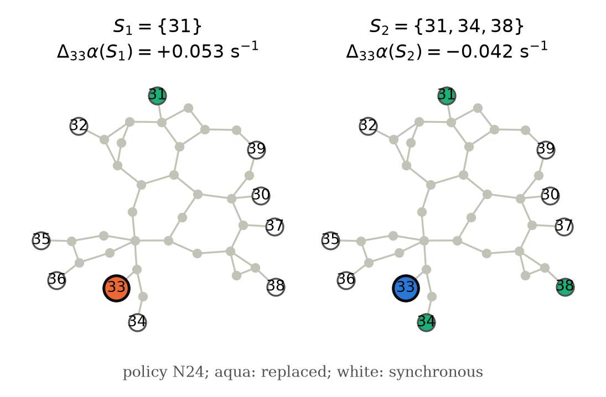

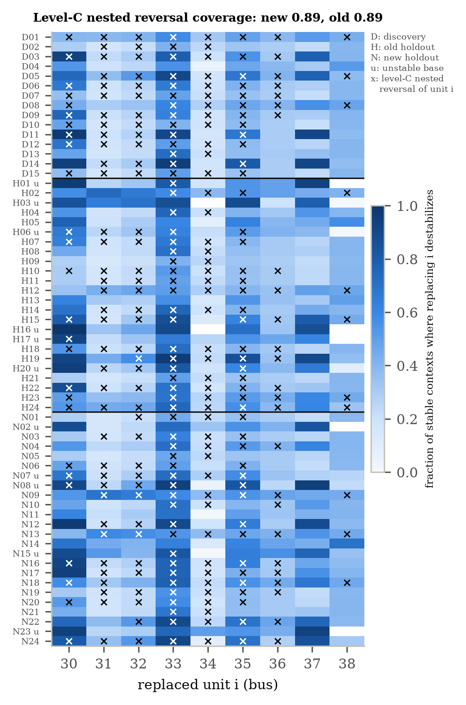

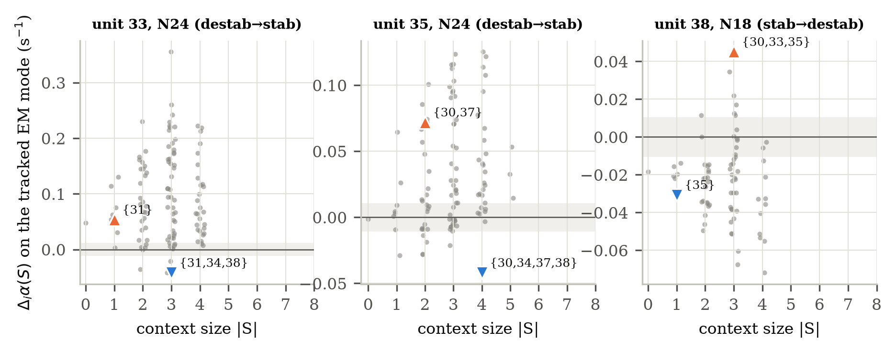

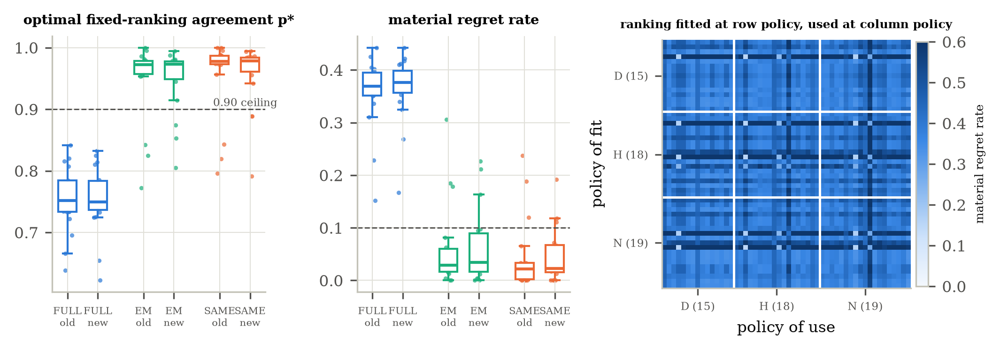

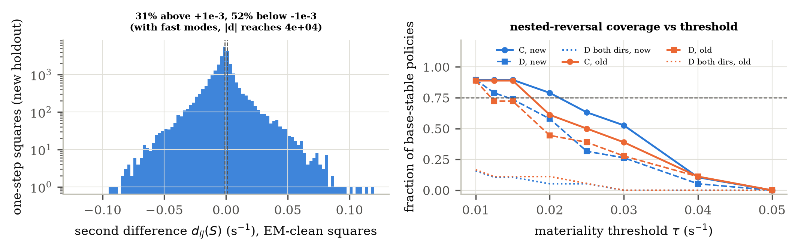

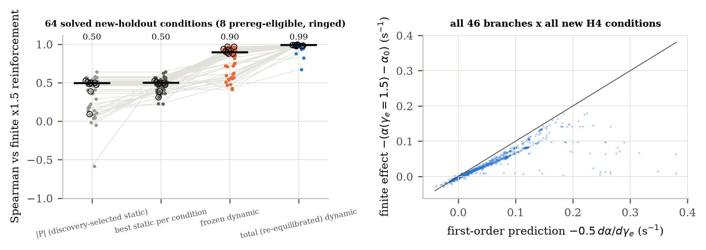

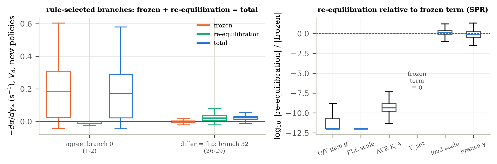

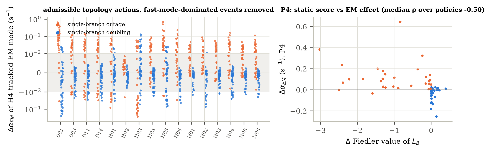

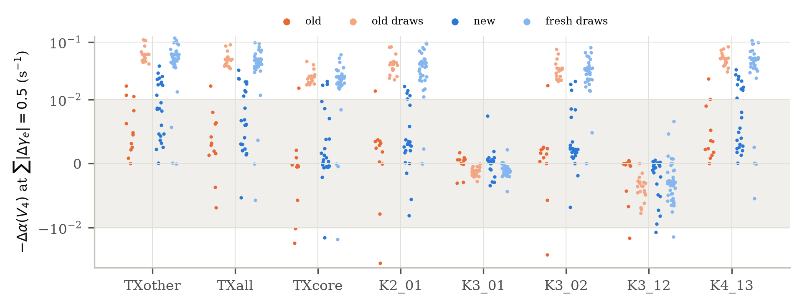

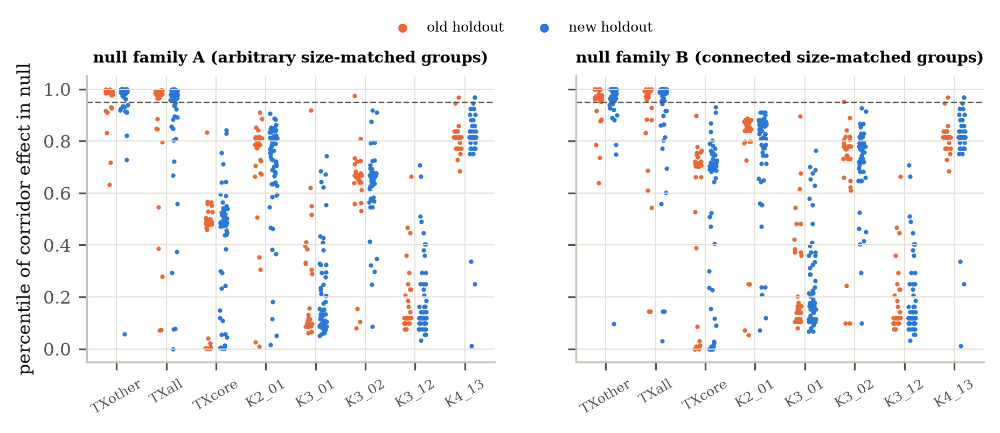

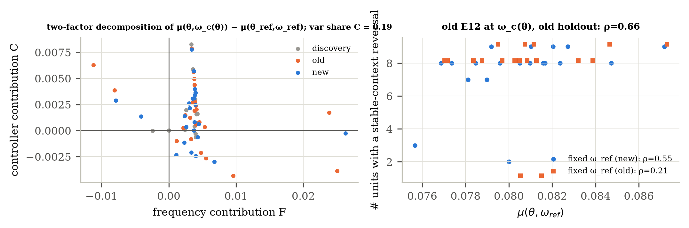

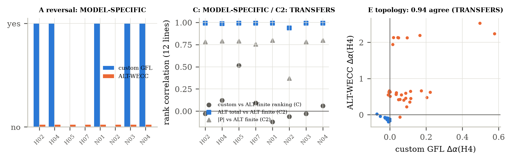

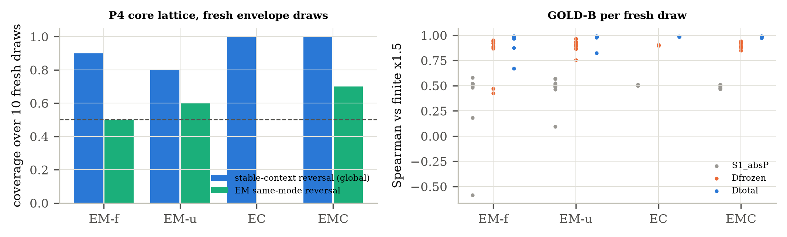

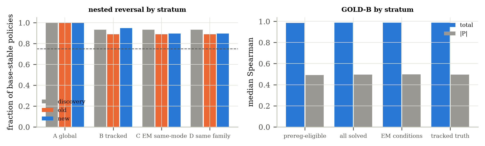

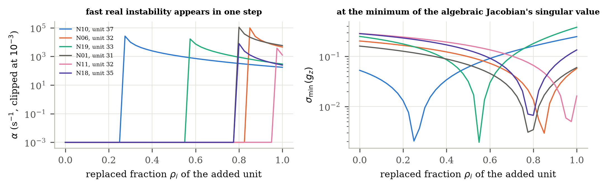

