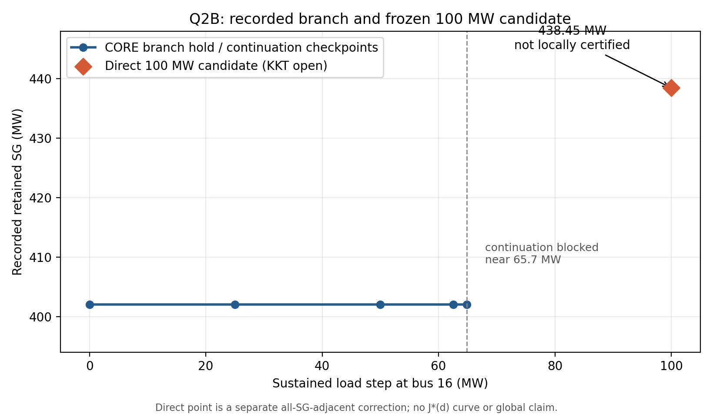
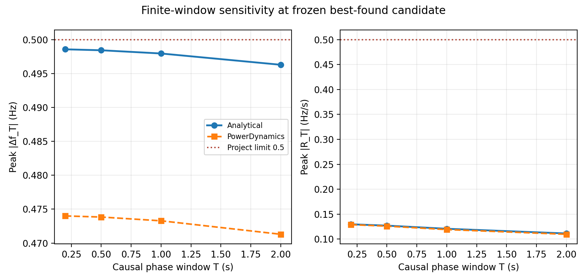
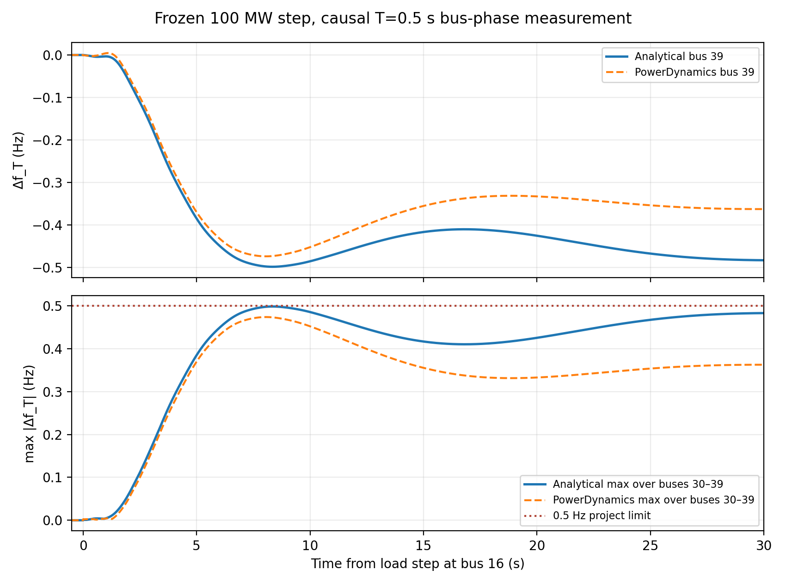

# Experiment Q2B — result report

## Status

**EXP_Q2B_STATUS: FAIL_OPTIMIZATION** (best feasible point found, not a locally certified optimum).

The PD-exact frozen model and component P/Q contract reproduce. The frozen 100 MW candidate passes its tested PowerDynamics spectral and T=0.5 s event limits. The design search did not produce a valid KKT certificate or a completed interval certificate for the robustness radius, so no secure optimum or global optimum is claimed.

## Frozen inputs and reproducibility

- Branch: `research/expQ2B-secure-optimum`; no push or commit.
- Model SHA: `e2f104608f1eb1705f0ad2c07764e7beab0a5df4deb4d4ce4f359b1e79947f0a`.
- Julia 1.11.9, PowerDynamics 5.0.0, NetworkDynamics 1.3.0.
- Candidate SHA-256: `f53250383cdb906a2d0cb3130ca9c1e72c63b472717c5c82aea1d5838ac785ce` ([frozen TOML](CORE/Z_Q2B_SECURE_T05_FINAL.toml)). No tuning occurred after the freeze.
- The ExpQ2 regression table passes 9/9 checks; it also verifies the inherited 14/14 baseline gate, trim contract, ExpN α, continuity/PLL DC findings, and NONAFFINE steady-frequency classification.
- Loads at buses 31 and 39 were kept separate from the generator component dispatch.

## Search and candidate

The custom normalized active-set SQP used the ten-bus mixed architecture, seeded adjacent to all-SG. The d=0 checkpoint was 402.063544 MW, but was already marked `BEST_FOUND_KKT_OPEN`. At 100 MW, that d=0 point has Fpeak(T=0.5)=0.762337 Hz, so it is event-infeasible. The held branch was feasible through 64.84375 MW; the predictor was blocked near 65.7 MW. A direct 100 MW correction from the all-SG-adjacent seed reached a feasible point. Two continuation/restoration passes reduced its cost to **438.446282 MW retained SG** and **4964.314808 MW GFL** (91.885% of initialized generator dispatch). The retained support is buses 30–39.

The direct candidate's normalized constraints are `[-0.00367052, -8e-08, -0.01656213, -0.00315025]` in order modal, robust β, steady frequency, peak frequency. Only the sampled robust row is within the 2e-4 active tolerance. The least-squares stationarity residual is **0.830103**; LICQ rank is 1 of 1; SOSC is not tested. The solver ended `NO_FEASIBLE_DESCENT`, so this is not a local optimum certificate. Only the all-SG-adjacent seed was optimized; support enumeration and multistart branch completeness remain open.

| Bus | ε retained SG | ρ GFL | Kp | Ki | Retained SG MW |
|---:|---:|---:|---:|---:|---:|
| 30 | 0.173835 | 0.826165 | 31.4815 | 276.191 | 43.4587 |
| 31 | 0.041762 | 0.958238 | 31.6375 | 270.811 | 21.3704 |
| 32 | 0.094066 | 0.905934 | 31.6990 | 278.060 | 61.1427 |
| 33 | 0.088910 | 0.911090 | 31.7195 | 300.871 | 56.1913 |
| 34 | 0.034053 | 0.965947 | 31.6031 | 287.961 | 17.2988 |
| 35 | 0.075326 | 0.924674 | 31.7066 | 299.467 | 48.9621 |
| 36 | 0.072732 | 0.927268 | 31.5956 | 290.665 | 40.7301 |
| 37 | 0.075837 | 0.924163 | 31.6164 | 296.950 | 40.9521 |
| 38 | 0.058636 | 0.941364 | 31.5716 | 313.817 | 48.6681 |
| 39 | 0.220158 | 0.779842 | 31.5015 | 251.372 | 59.6720 |

### Frozen candidate metrics

- α analytic: -0.050036705173 s⁻¹ (margin to −0.05 is 3.671e-05 s⁻¹).
- Full frequency-refined β-star observed: 1.699121139343346e-06; requirement: 1.699120699918204e-06; observed difference: 4.394e-13.
- Peak resolvent is at ω=0 rad/s. The Float64 Lipschitz audit exhausted 50,000 nodes (`INCOMPLETE_INTERVAL_BOUND`). Its partial lower estimate is 1.699120700418876e-06, only 5.007e-16 above the requirement, but is **not a completed certificate**. No outward-rounded proof was performed.
- Analytical bus-grid metrics: F∞=0.491719 Hz; Fpeak(T=0.5)=0.498425 Hz.
- Analytic finite-window RoCoF: T=0.2s: R=0.129679; T=0.5s: R=0.126984; T=1s: R=0.120662; T=2s: R=0.111252 Hz/s. This candidate point passes all four windows; no separate window-conditioned optimum was solved because the design itself remained uncertified.
- Robustness claim: `OBSERVED_MARGIN_ONLY; CERTIFICATE_INCOMPLETE`.

## Independent PowerDynamics validation after freeze

- Trim residual max: 4.470e-11; component P error 8.298e-13 pu; Q error 1.063e-13 pu; component bounds and separate ZIP loads pass.
- 203 physical finite poles; gauge pole -7.809e-11; analytic α -0.050036705173, PD α -0.050036705182; max pole mismatch 4.619e-10 s⁻¹.
- Nonlinear +100 MW bus16 event, causal T=0.5 s: Fpeak=0.473842 Hz, Fsteady=0.358294 Hz, Rpeak=0.125921 Hz/s; 2% settling to the measured final plateau at 24.36 s. Project limits pass in this simulation.
- The analytic large-step prediction is conservative relative to PD: Fpeak differs by -0.024583 Hz and steady frequency by -0.133425 Hz. The 100 MW response is nonlinear; the spectral identity remains excellent.

Out-of-sample PD events (same measurement, not used as constraints):

| Event | Fpeak (Hz) | Fsteady (Hz) | Rpeak (Hz/s) | Pass |
|---|---:|---:|---:|:---:|
| bus 8, 100.0 MW | 0.428333 | 0.318463 | 0.179890 | True |
| bus 29, 100.0 MW | 0.493205 | 0.391703 | 0.162178 | True |
| bus 16, 25.0 MW | 0.123516 | 0.112898 | 0.031737 | True |
| bus 16, 50.0 MW | 0.243409 | 0.216409 | 0.063328 | True |

All four out-of-sample simulations completed with successful solver retcodes. No current-limit safety claim is made.

## Why this is not an optimum claim

The robust constraint is almost exactly binding, but its interval search did not finish and the custom SQP stopped before stationarity. The KKT stationarity residual is materially nonzero; SOSC and competing supports were not certified. The d=0 continuation branch did not reach 100 MW. Therefore the result is a validated **best-found feasible candidate** for the declared event, not `Z*_secure`, not a local KKT optimum, and not global. The lower-bound/upper-bound gap remains open; the only unconditional lower bound is 0 MW retained SG.

The modal margin is slack at the candidate and there is no modal multiplier. A BND direct/self-energy decomposition was therefore withheld; the plotted bus derivatives are sensitivity diagnostics only.

## Artifacts and runtime evidence

- Design implementation: `src/bnd_expQ2B/`.
- Scripts: `experiments/bnd_expQ2B/`.
- Tables, sensor traces, candidate freeze, and audit TOMLs: `reports/experiment_Q2B/CORE/` and `REGRESSION/`.
- Figures: `reports/experiment_Q2B/FIGURES/`.
- The adaptive robustness interval audit used 50,001 nodes and 733.416 s before returning incomplete. The optimization histories record 24 initial direct iterations, 27 extension iterations (19 accepted), and 6 restoration iterations (1 accepted); no optimizer timing was instrumented. Post-freeze validation used one full-spectrum PD rebuild plus five nonlinear event simulations.

## Figures

